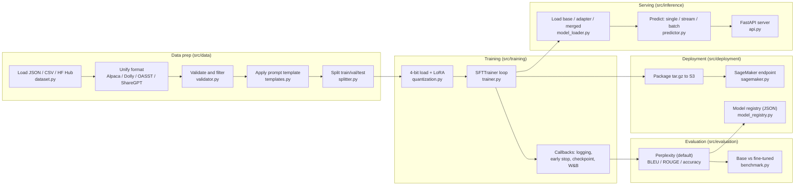

# LLM Fine-Tuning Pipeline

[](https://www.python.org/downloads/)
[](LICENSE)

A pipeline for fine-tuning open-source large language models with QLoRA (4-bit quantized LoRA), evaluating them, serving them over a FastAPI HTTP API, and deploying them to AWS SageMaker. The default configs target Mistral-7B and Llama-3-8B, but any HuggingFace causal language model can be used.

## What this project does

You give it instruction data (for example Alpaca-style instruction/input/output records). The pipeline:

1. Loads the data, converts mixed formats to one unified schema, validates it, applies a prompt template, and splits it into train/validation/test.
2. Loads a base model (4-bit quantized when a GPU is present), attaches small trainable LoRA adapters, and fine-tunes with the TRL `SFTTrainer`.
3. Measures the fine-tuned model (perplexity by default; BLEU, ROUGE, and exact-match accuracy are available as library calls).
4. Serves the model locally as an interactive REPL or a FastAPI server, and can package and deploy it to a SageMaker endpoint.

The code runs on CPU as well. When no CUDA GPU is detected, quantization and mixed precision are turned off automatically and the model loads in float32 on CPU (see `src/training/quantization.py:101` and `src/training/trainer.py:113`). This is what makes the `--dry-run` setup path usable without a GPU.

## Key concepts, explained simply

- **Fine-tuning**: continuing to train a pretrained model on your own data so it follows your task or style. Here the base model's weights stay frozen and only the adapters are trained.
- **LoRA (Low-Rank Adaptation)**: instead of updating all billions of weights, LoRA inserts a few small trainable matrices into the attention and MLP layers. Only those are trained, so memory use and checkpoint size drop sharply. The adapter config lives in `src/training/quantization.py:154`.
- **Quantization / QLoRA**: the frozen base model is loaded in 4-bit (NF4) precision to cut GPU memory, while the LoRA adapters train in higher precision. The 4-bit config is built in `src/training/quantization.py:52`. QLoRA is the combination: 4-bit base plus LoRA adapters.
- **PEFT (Parameter-Efficient Fine-Tuning)**: the HuggingFace library that implements LoRA. `get_peft_model` wraps the base model with adapters in `src/training/quantization.py:192`.
- **Data to train to evaluate to infer**: prepare data, train adapters, score the result, then load the adapters (or merge them into the base) for generation.

## Architecture



## What actually runs by default

- Training is real. `scripts/train.py` builds the BitsAndBytes config, loads the model, applies LoRA, wires four callbacks, and calls `SFTTrainer.train()` unless `--dry-run` is passed (`src/training/trainer.py:185`).
- The evaluation CLI (`scripts/evaluate.py`) computes perplexity only. `ModelEvaluator.evaluate_all` runs perplexity and returns (`src/evaluation/evaluator.py:261`). BLEU, ROUGE, and exact-match accuracy are implemented and tested, but they are separate methods (`evaluate_generation`, `evaluate_task_accuracy`) that the CLI does not call; use them directly from code.
- BLEU here is a simplified unigram-precision score with a brevity penalty, not standard 4-gram corpus BLEU (`src/evaluation/evaluator.py:298`). ROUGE-1/2/L use n-gram and longest-common-subsequence F1 (`src/evaluation/evaluator.py:322`). These are dependency-free implementations, not the `evaluate`/`sacrebleu` libraries.
- Inference (single, streaming, batch) and the FastAPI server are real (`src/inference/predictor.py`, `src/inference/api.py`).
- SageMaker deploy, invoke, status, and delete are real boto3 calls (`src/deployment/sagemaker.py`). They require live AWS credentials and an execution role; nothing is mocked outside the tests.
- There is no DeepSpeed or multi-GPU/distributed orchestration. `accelerate` is installed because TRL/Transformers use it, but this repo does not import it directly.

## Supported models

| Model | Config | max_seq_length |
|-------|--------|----------------|
| Mistral-7B-v0.3 | `configs/mistral_7b_qlora.yaml` | 2048 |
| Meta-Llama-3-8B | `configs/llama3_8b_qlora.yaml` | 4096 |

Memory use depends on GPU, sequence length, and batch size, so this README does not quote a fixed GB figure. Llama 3 is a gated model on the Hub, so set `HF_TOKEN` in `.env` to download it.

## Quick start

```bash
# 1. Install
pip install -e ".[dev]"

# 2. Configure environment (optional for CPU dry runs)
cp .env.example .env
# Set HF_TOKEN for gated models, and AWS/W&B values if you use them.

# 3. Inspect and prepare data (writes JSONL splits to data/processed by default)
python -m scripts.prepare_data \
  --source data/sample/sample_alpaca.json \
  --template alpaca

# 4. Set up training without a GPU (dry run: builds everything, skips the train loop)
python -m scripts.train \
  --config configs/mistral_7b_qlora.yaml \
  --dataset data/sample/sample_alpaca.json \
  --dry-run --no-wandb

# 5. Evaluate a saved model (perplexity)
python -m scripts.evaluate \
  --model outputs/final \
  --dataset data/sample/sample_alpaca.json \
  --no-wandb

# 6. Interactive inference
python -m scripts.inference --model outputs/final --mode repl

# 7. Start the API server
python -m scripts.inference --model outputs/final --mode server --port 8000

# 8. Deploy to SageMaker (needs AWS credentials and a SageMaker role)
python -m scripts.deploy --action deploy \
  --model-path outputs/final \
  --instance-type ml.g5.xlarge
```

Note on data formats: `scripts.train` and `scripts.evaluate` read local datasets with a JSON-array loader (`DatasetLoader.load_from_json`, `src/data/dataset.py:62`), so pass a `.json` array file such as `data/sample/sample_alpaca.json`. `scripts.prepare_data` writes line-delimited `.jsonl` split files (`scripts/prepare_data.py:207`); those are for inspection and downstream tooling, not as a direct `--dataset` argument to the JSON-array loader. To train on HuggingFace Hub data instead, pass `--dataset <name> --hf`.

## Inference API

Start the server with `make inference-server MODEL=outputs/final` or the `scripts.inference --mode server` command above. The default host is `0.0.0.0` and port `8000`.

| Endpoint | Method | Description |
|----------|--------|-------------|
| `/health` | GET | Status and whether a model is loaded |
| `/model/info` | GET | Model name, device, max sequence length, parameter stats |
| `/predict` | POST | Single-prompt generation |
| `/predict/stream` | POST | Token-by-token streaming response |
| `/predict/batch` | POST | Batch generation (up to 32 prompts) |

Endpoints and request schemas are defined in `src/inference/api.py:97`. Example:

```bash
curl -X POST http://localhost:8000/predict \
  -H "Content-Type: application/json" \
  -d '{"prompt": "Explain quantum computing", "max_new_tokens": 256, "temperature": 0.7}'
```

## Screenshot surface

Open the interactive API docs at **http://localhost:8000/docs** after starting the server. FastAPI auto-generates this Swagger UI from the route and Pydantic model definitions in `src/inference/api.py`, so it is the single best visual: it lists every endpoint with editable request bodies and a try-it-out button. There is no separate metrics dashboard wired into this repo; Weights & Biases is the only experiment tracker integrated (see below), and you view its charts on wandb.ai when `report_to: wandb` is active.

## Training configuration

Hyperparameters come from a YAML config loaded into a dataclass (`src/config/training_config.py:83`). Defaults:

| Parameter | Default | Meaning |
|-----------|---------|---------|
| `lora_r` | 16 | LoRA rank |
| `lora_alpha` | 32 | LoRA scaling factor |
| `lora_dropout` | 0.05 | LoRA dropout |
| `learning_rate` | 2e-4 | Peak learning rate |
| `num_epochs` | 3 | Training epochs |
| `per_device_train_batch_size` | 4 | Batch size per device |
| `gradient_accumulation_steps` | 4 | Effective batch size 16 |
| `lr_scheduler_type` | cosine | Learning-rate schedule |
| `max_seq_length` | 2048 | Token sequence cap |
| `bnb_4bit_quant_type` | nf4 | 4-bit quantization type |

`TrainingConfig.validate` (`src/config/training_config.py:106`) range-checks these and the training CLI exits if any check fails. See `configs/` for the full files and `docs/TRAINING_GUIDE.md` for tuning notes.

## Experiment tracking

When `report_to` is `wandb` (the config default), training and evaluation log to Weights & Biases through `src/utils/wandb_utils.py`. The `WandbMetricsCallback` (`src/training/callbacks.py:18`) logs loss, learning rate, gradient norm, and GPU memory each step. Pass `--no-wandb` to disable it; W&B init failures are caught and downgrade to a warning, so the run continues without tracking.

## Project layout

```
src/
  config/      settings.py (env via pydantic), training_config.py (YAML dataclass)
  data/        dataset.py, templates.py, validator.py, splitter.py
  training/    quantization.py, trainer.py, callbacks.py
  evaluation/  evaluator.py, benchmark.py, human_eval.py
  inference/   model_loader.py, predictor.py, api.py
  deployment/  sagemaker.py, infrastructure.py, model_registry.py
  utils/       logger.py (structlog), wandb_utils.py
configs/       mistral_7b_qlora.yaml, llama3_8b_qlora.yaml
scripts/       prepare_data.py, train.py, evaluate.py, inference.py, deploy.py
docker/        Dockerfile, Dockerfile.train, Dockerfile.inference
.github/workflows/  ci.yml, train.yml, deploy.yml
tests/         unit/ and integration/
```

## Tech stack

| Area | Tools |
|------|-------|
| Fine-tuning | PyTorch, Transformers, PEFT, TRL, bitsandbytes |
| Data | HuggingFace Datasets |
| API | FastAPI, Uvicorn |
| Deployment | AWS SageMaker, boto3 |
| Tracking | Weights & Biases |
| Config | Pydantic Settings, PyYAML |
| Logging | structlog |
| Testing | pytest, pytest-cov |
| Lint / types | Ruff, mypy |

## Development

```bash
make install        # pip install -e ".[dev]"
make test           # pytest with coverage, fails under 80%
make test-unit      # unit tests only
make lint           # ruff check + mypy
make format         # ruff auto-fix and format
make clean          # remove caches and build artifacts
```

There are 255 test functions across `tests/unit/` and `tests/integration/`. The CI workflow runs lint, mypy, and the test suite on Python 3.11 and 3.12 with an 80% coverage gate (`.github/workflows/ci.yml`).

## Docker

```bash
make docker-train       # build docker/Dockerfile.train (CUDA 12.1 base)
make docker-inference   # build docker/Dockerfile.inference (CPU torch, slim)
make docker-build       # build both
```

`Dockerfile.train` is a CUDA runtime image whose entrypoint is `scripts.train` (defaults to a Mistral dry run). `Dockerfile.inference` is a slim CPU image that installs CPU-only torch, exposes port 8000, includes a `/health` healthcheck, and starts the inference server. There is no `docker-compose.yml` in this repo.

## Cloud deployment

The only cloud path with code and config in this repo is **AWS SageMaker**:

- `src/deployment/sagemaker.py` packages the model to `model.tar.gz`, uploads to S3, creates a SageMaker model backed by the HuggingFace PyTorch inference Deep Learning Container, and creates or updates a real-time endpoint.
- `.github/workflows/deploy.yml` is a manual (`workflow_dispatch`) GitHub Actions job that configures AWS credentials, runs `scripts.deploy --action deploy`, runs an invoke smoke test, and deletes the endpoint on failure.
- `.github/workflows/train.yml` runs data prep and training on `ubuntu-latest` for dry runs or a `self-hosted-gpu` runner for real training, then uploads the model as an artifact.
- `src/deployment/infrastructure.py` can create the S3 bucket and IAM execution role and estimate per-hour instance cost.

GCP and Azure are not wired into this repo. There are no Vertex AI, Cloud Run, Azure ML, or Container Apps config files here. To run on those platforms you would reuse the same `Dockerfile.inference` image (it is a standard CPU FastAPI server on port 8000) and supply each platform's own service config, which this repo does not include.

## Algorithms and methods, with sources

| Claim | Source |
|-------|--------|
| 4-bit NF4 quantization config (load_in_4bit, nf4, double quant) | `src/training/quantization.py:52` |
| CPU fallback: no quantization, float32 when no GPU | `src/training/quantization.py:101` |
| LoRA adapter config (r, alpha, dropout, target_modules, CAUSAL_LM) | `src/training/quantization.py:154` |
| LoRA applied via PEFT get_peft_model; trainable-param stats logged | `src/training/quantization.py:192` |
| Default LoRA target modules (q/k/v/o/gate/up/down proj) | `src/config/training_config.py:30` |
| TRL SFTTrainer used for the training loop | `src/training/trainer.py:159` |
| Training loop runs, then evaluates and saves final checkpoint | `src/training/trainer.py:185` |
| Mixed precision disabled and use_cpu set when no GPU | `src/training/trainer.py:113` |
| Early stopping on eval_loss with patience | `src/training/callbacks.py:65` |
| Top-K best-checkpoint saving by eval_loss | `src/training/callbacks.py:131` |
| W&B per-step logging of loss, lr, grad norm, GPU memory | `src/training/callbacks.py:18` |
| Perplexity from mean token loss (exp of avg loss) | `src/evaluation/evaluator.py:87` |
| evaluate_all computes perplexity only | `src/evaluation/evaluator.py:261` |
| BLEU is unigram precision with brevity penalty (not 4-gram) | `src/evaluation/evaluator.py:298` |
| ROUGE-1/2 n-gram F1 and ROUGE-L LCS F1 | `src/evaluation/evaluator.py:322` |
| Exact-match task accuracy via greedy generation | `src/evaluation/evaluator.py:194` |
| Base vs fine-tuned comparison and improvement delta | `src/evaluation/benchmark.py:53` |
| Format auto-detection (Alpaca/Dolly/OASST/ShareGPT) | `src/data/dataset.py:26` |
| Convert all formats to unified instruction/input/output | `src/data/dataset.py:139` |
| Validation: schema, quality, length, duplicate removal | `src/data/validator.py:195` |
| Train/val/test split with ratio checks | `src/data/splitter.py:15` |
| Four prompt templates (Alpaca, ChatML, Llama-3, Mistral) | `src/data/templates.py:183` |
| Single / streaming / batch generation | `src/inference/predictor.py:73` |
| Streaming via TextIteratorStreamer on a worker thread | `src/inference/predictor.py:118` |
| FastAPI endpoints and request models | `src/inference/api.py:97` |
| Load base / fine-tuned (LoRA) / merged model | `src/inference/model_loader.py:27` |
| SageMaker package to S3, create model, deploy endpoint | `src/deployment/sagemaker.py:78` |
| HuggingFace PyTorch inference DLC image used for SageMaker | `src/deployment/sagemaker.py:22` |
| S3 bucket and IAM role setup, cost estimation | `src/deployment/infrastructure.py:49` |
| JSON-based model registry with best-by-metric selection | `src/deployment/model_registry.py:119` |
| Human-eval sample export to Markdown/CSV/JSON | `src/evaluation/human_eval.py:51` |

## Documentation

- [Training Guide](docs/TRAINING_GUIDE.md)
- [Architecture](docs/ARCHITECTURE.md)
- [Deployment](docs/DEPLOYMENT.md)
- [Results template](docs/RESULTS.md)
- [Contributing](CONTRIBUTING.md)

## License

MIT
